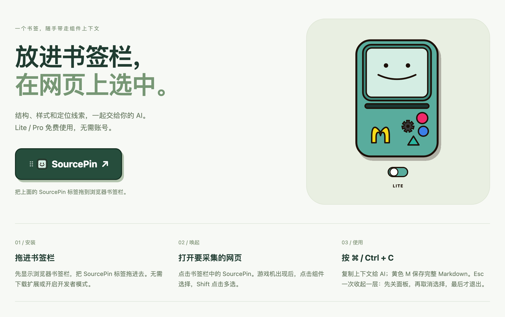

# SourcePin

选中网页上的任意组件，得到可以交给 AI 的定位、结构与样式上下文。全部在本地运行，不上传内容，不需要账号。

[](https://n107meow.github.io/SourcePin/)

点上面这张图，或直接打开安装页：**<https://n107meow.github.io/SourcePin/>**

## 立即使用（书签版，推荐）

不需要安装 Node.js，也不需要启动本地服务。

1. 显示浏览器书签栏（macOS：<kbd>⌘</kbd>+<kbd>Shift</kbd>+<kbd>B</kbd>，Windows/Linux：<kbd>Ctrl</kbd>+<kbd>Shift</kbd>+<kbd>B</kbd>）。
2. 在安装页把绿色的 **SourcePin** 标签拖进书签栏。
3. 打开任意普通网页，点击书签栏里的 SourcePin，指向元素后点击选中。
4. 按 <kbd>⌘</kbd>/<kbd>Ctrl</kbd>+<kbd>C</kbd> 复制摘要，或按黄色 M 按钮下载完整内容。

第一次复制或下载会显示一次本地确认（含疑似个人信息计数与第三方处理提示），点「继续导出」即可；**取消不等于同意**，下次仍会询问。

## 另外两种安装方式

**离线安装包**：到 [Releases](https://github.com/N107meow/SourcePin/releases/latest) 下载 `sourcepin-0.1.6-delivery.zip`，解压后双击 `install.html`，安装方式与线上安装页相同；包内还带校验和与说明。

**Chrome 扩展（可选增强）**：本仓库根目录的 [`extension/`](./extension) 就是可直接加载的 MV3 扩展，已随源码提交，克隆后无需构建。

1. 克隆仓库：`git clone https://github.com/N107meow/SourcePin.git`
2. 打开 `chrome://extensions`（Edge 为 `edge://extensions`），开启右上角**开发者模式**。
3. 点「加载已解压的扩展程序」，选择仓库根目录的 `extension/` 文件夹。
4. 打开普通网页，点扩展图标或按 <kbd>⌘</kbd>/<kbd>Ctrl</kbd>+<kbd>Shift</kbd>+<kbd>Y</kbd>。

扩展相对书签版多出三件事：组件截图、跨会话本地偏好保存、全局快捷键。书签版与扩展版共享同一套采集内核，导出内容一致；书签版不提供截图与偏好保存，严格 CSP 的页面可能阻止运行。

## 能做什么

- **定位**：标签、文本摘要、净化后的属性，以及多个经过回查的定位器。
- **结构与样式**：清洗后的 HTML、有界采样的 CSS、伪元素与动画采样、结构 JSON。
- **交互记录**（Pro）：真实触发的 hover / focus / 点击 / 页面变化。
- **整页 DOM**：下载可离线打开的 ZIP，图片以同尺寸占位标记（不下载像素）。
- **多选**：最多 10 个目标，共享 600 节点预算；预算触顶会明确写在报告的 Degradations 里。

## 仓库结构

```text
SourcePin/
├─ extension/         可直接加载的 MV3 扩展（唯一纳入版本控制的构建产物，见下）
│  ├─ manifest.json   MV3 清单，版本号在构建时取自 package.json
│  ├─ content.js      内容脚本（由 src/content.ts 打包）
│  ├─ background.js   后台 service worker（由 src/extension/background.ts 打包）
│  ├─ icon-16/32/48/128.png
│  └─ INSTALL.txt     加载步骤速查
├─ public/            扩展清单模板与四个尺寸的图标（图标由 node scripts/make-icons.mjs 重新渲染）
├─ src/               全部 TypeScript 源码
│  ├─ controller.ts   拾取、多选、生命周期与 UI 编排
│  ├─ core/           捕获、定位器、隐私过滤、录制与 Markdown 输出
│  ├─ ui/             Shadow DOM 游戏机、面板与高亮
│  ├─ extension/      MV3 后台与扩展平台适配
│  └─ platform/       书签版与扩展版共享的浏览器适配
├─ site/              GitHub Pages 安装页模板 → 构建到 dist/site/
├─ demo/              本地人工验收页
├─ scripts/           构建、交付打包、图标渲染与静态服务
├─ tests/             自动化验证（node:test + Playwright）
├─ docs/              契约、验收与发布说明
│  ├─ ACCEPTANCE-SPEC.md   当前能力与验收契约（改行为时同步更新）
│  ├─ ACCEPTANCE.md        10 分钟人工验收步骤
│  ├─ PUBLISHING.md        GitHub Pages 与 Release 的发布流程
│  └─ dev/                 开发期报告与测试证据，作为历史记录保留
├─ .gitignore
├─ LICENSE
└─ README.md
```

`extension/` 是唯一提交进仓库的构建产物：这样克隆下来就能在 `chrome://extensions` 直接加载，不必先装 Node.js。它由 `npm run build` 生成，与 `dist/sourcepin-<版本>-chrome.zip` 内容逐字节一致；改动 `src/` 后重新构建并一起提交即可。其余产物（书签源码、安装页、ZIP、校验和）都在 `dist/`，不进版本控制。

## 本地开发

需要 Node.js 22 或更高版本。

```bash
npm ci
npx playwright install chromium
npm run check
npm run dev
```

| 命令 | 作用 |
| --- | --- |
| `npm run build` | 构建 `extension/`、书签源码、`dist/site/` 安装页、两个 ZIP 与 `dist/SHA256SUMS` |
| `npm run dev` | 在 <http://127.0.0.1:4317> 提供验收页（`demo/` 与 `dist/`），只监听本机 |
| `npm run check` | 类型检查 + 单元/浏览器测试 + 构建，交付前至少跑这一条 |
| `npm run test:e2e` | 端到端流程，需要先运行 `npm run dev` |
| `npm run delivery` | 在 `artifacts/` 生成可分发整包（安装页 + 扩展 + 书签源码 + 校验和） |
| `GITHUB_TOKEN=$(gh auth token) node scripts/publish-github.mjs` | 用 GitHub API 推送当前分支（`git push` 被网络挡住时的替代路径，见 `docs/PUBLISHING.md`） |
| `node scripts/make-icons.mjs` | 改动方形图标（游戏机屏幕样式）后重新渲染 `public/icon-*.png` |

人工证据写在 `artifacts/`，构建产物写在 `dist/`，两者都不纳入版本控制。构建带跨进程锁（`dist/.build-lock`），并发构建会排队而不是互相写入对方的半成品。

## 扩展权限与隐私

| 权限 | 为什么需要 |
| --- | --- |
| `activeTab` | 只在你主动点击图标或按快捷键后访问当前标签页，不后台常驻读取页面 |
| `scripting` | 把采集内核注入当前标签页 |
| `storage` | 把模式、语言、节点预算等偏好存在 `chrome.storage.local`，不上传 |
| `downloads`（可选，按需申请） | 首次下载 Markdown 或整页 ZIP 时才申请；拒绝后仍可用普通下载 |

- 本地采集：无账号、无上传、无遥测；书签版不保存跨会话偏好，扩展版只写入 `chrome.storage.local`。
- 导出前本地扫描邮箱、手机号、身份证号与地址模式，只显示去重计数；启发式检测可能误报或漏报，不等同于匿名化。
- DOM 输出会过滤表单值、脚本、事件属性、敏感属性和 URL 参数（含 `#fragment` 中的 `access_token` 一类参数）；截图是页面像素，其中文字未经 OCR 脱敏。
- 运行期间不改动你正在看的页面：标题、`<head>`（含 favicon）与地址栏 URL 保持不变。
- 书签栏那一项的图标由浏览器决定：`javascript:` 书签没有可抓取的站点图标，SourcePin 不去改页面图标来伪装它。
- 采样与预算是明确契约：图片只放占位、CSS 是有界采样、closed shadow 与跨源 iframe 内容不可访问。

## 许可证

[MIT](./LICENSE)。导出内容（网页文本、图片、Logo）的权利仍归原站/原作者，本许可证不授予这些内容的使用权。

## 反馈

使用问题或建议请开 [Issue](https://github.com/N107meow/SourcePin/issues)。
